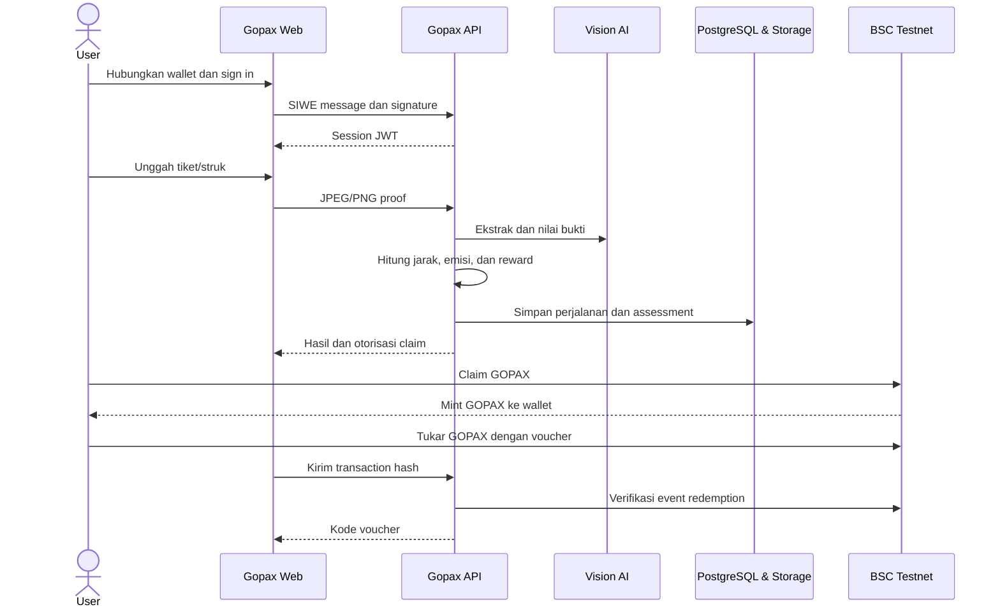
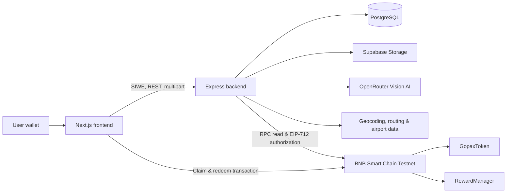

# Gopax

**Turn everyday trips into measurable impact and useful rewards.**

Gopax adalah consumer application berbasis Web3 yang membantu pengguna memahami estimasi emisi perjalanannya. Pengguna mengunggah tiket atau struk perjalanan, sistem membaca bukti tersebut dengan vision AI, menghitung estimasi emisi menggunakan aturan deterministik, lalu memberikan reward GOPAX untuk perjalanan yang memenuhi syarat. GOPAX dapat ditukar dengan voucher melalui transaksi di BNB Smart Chain Testnet.

## Daftar isi

- [Mengapa Gopax](#mengapa-gopax)
- [Cara kerja](#cara-kerja)
- [Fitur utama](#fitur-utama)
- [Arsitektur](#arsitektur)
- [Teknologi](#teknologi)
- [Struktur repository](#struktur-repository)
- [Menjalankan secara lokal](#menjalankan-secara-lokal)
- [Konfigurasi](#konfigurasi)
- [Reward dan estimasi emisi](#reward-dan-estimasi-emisi)
- [Smart contracts](#smart-contracts)
- [Live deployment](#live-deployment)
- [API](#api)
- [Testing dan verifikasi](#testing-dan-verifikasi)
- [Keamanan dan batasan](#keamanan-dan-batasan)
- [Status project](#status-project)
- [Menjalankan demo](#menjalankan-demo)
- [Troubleshooting](#troubleshooting)
- [Dokumentasi lanjutan](#dokumentasi-lanjutan)

## Mengapa Gopax

Perjalanan harian menghasilkan dampak lingkungan, tetapi informasi tersebut jarang terlihat oleh pengguna. Tiket biasanya berhenti digunakan setelah perjalanan selesai, padahal tiket dapat menjadi bukti awal untuk membantu pengguna memahami moda, rute, jarak, dan estimasi emisinya.

Menurut IPCC, transportasi menyumbang sekitar 23% emisi CO₂ global terkait energi pada 2019 dan sekitar 70% emisi langsung sektor transportasi berasal dari kendaraan jalan raya. WHO juga menyebut perpindahan dari kendaraan pribadi ke angkutan umum dapat memberi manfaat berupa penurunan polusi udara perkotaan, kemacetan, kebisingan, dan risiko kecelakaan.

Gopax menggunakan tiket perjalanan sebagai titik masuk yang sederhana:

1. membuat dampak perjalanan lebih mudah dipahami;
2. memberi insentif berdasarkan intensitas emisi moda, bukan panjang perjalanan;
3. memberikan kepemilikan reward kepada pengguna melalui wallet; dan
4. menghubungkan reward dengan manfaat melalui katalog voucher.

Referensi masalah:

- [IPCC AR6 WGIII — Chapter 10: Transport](https://www.ipcc.ch/report/ar6/wg3/chapter/chapter-10/)
- [WHO — Strategies for healthy and sustainable transport](https://www.who.int/teams/environment-climate-change-and-health/healthy-urban-environments/transport/strategies)
- [BPS — Statistik Komuter Jabodetabek 2023](https://www.bps.go.id/id/publication/2024/03/28/33b6bef825944e576e7ea3ba/commuter-statistics-of-jabodetabek-results-of-jabodetabek-commuter-surveys-2023.html)
- [OECD — How Green Is Household Behaviour?](https://www.oecd.org/en/publications/how-green-is-household-behaviour_2bbbb663-en.html)

## Cara kerja



### Perjalanan pengguna

1. **Connect wallet** — pengguna menghubungkan wallet pada BSC Testnet.
2. **Sign in** — autentikasi menggunakan Sign-In with Ethereum (SIWE); tanda tangan login tidak mengirim transaksi dan tidak memakai gas.
3. **Upload proof** — pengguna mengunggah satu tiket atau struk dalam format JPEG/PNG, maksimum 10 MiB.
4. **Assessment** — vision AI mengekstrak moda, asal, tujuan, tanggal, dan jarak jika tersedia. Backend memvalidasi hasil dan menghitung jarak serta estimasi emisi.
5. **Reward decision** — AI menilai apakah bukti mendukung konteks perjalanan. Jumlah token selalu dihitung oleh backend menggunakan kebijakan tetap.
6. **Claim** — backend menerbitkan otorisasi EIP-712 yang terbatas untuk wallet, assessment, jumlah, dan deadline tertentu. Wallet pengguna mengirim transaksi claim.
7. **Redeem** — pengguna menyetujui penggunaan token lalu menukarkan GOPAX dengan voucher. Backend hanya mengeluarkan kode setelah event on-chain terverifikasi.

## Fitur utama

- Autentikasi berbasis wallet menggunakan SIWE dan JWT.
- Ekstraksi informasi tiket atau struk menggunakan vision AI dengan model fallback.
- Validasi signature file, batas ukuran, hash SHA-256, dan penolakan bukti identik milik pengguna yang sama.
- Estimasi jarak melalui data pada bukti, routing darat, atau great-circle distance untuk penerbangan.
- Perhitungan emisi deterministik di backend; AI tidak menentukan faktor emisi atau jumlah reward.
- Perbandingan emisi terhadap mobil untuk perjalanan bus dan kereta yang didukung.
- Dashboard impact, transport mix, daftar perjalanan, filter, dan detail assessment.
- Token GOPAX BEP-20 dengan supply maksimum 10 juta GOPAX.
- Claim reward dengan EIP-712, deadline, policy on-chain, dan pencegahan klaim ganda.
- Pemulihan status claim ketika transaksi berhasil tetapi sinkronisasi API tertunda.
- Katalog voucher, pembayaran token ke treasury, verifikasi event, anti-replay transaction hash, dan riwayat voucher pengguna.
- Mode preview frontend dengan berbagai fixture dan error state tanpa backend atau wallet.

## Arsitektur

Gopax menggunakan arsitektur hybrid. Data pribadi, gambar bukti, AI, dan kalkulasi disimpan atau dijalankan off-chain. Blockchain digunakan pada bagian yang membutuhkan kepemilikan token, otorisasi kriptografis, dan transaksi yang dapat diverifikasi.



### Pembagian tanggung jawab

| Komponen | Tanggung jawab |
| --- | --- |
| Frontend | Wallet connection, onboarding, upload, dashboard, claim, voucher redemption, receipt recovery |
| Backend | SIWE, validasi input, pemrosesan bukti, perhitungan emisi/reward, EIP-712 signing, verifikasi receipt |
| PostgreSQL | User, trip, proof metadata, carbon/AI assessment, reward, voucher, dan redemption history |
| Supabase Storage | File bukti perjalanan |
| Vision AI | Ekstraksi informasi dan penilaian kesesuaian bukti |
| Distance providers | Geocoding, estimasi rute darat, dan jarak antarabandara |
| GopaxToken | Token GOPAX dan kontrol mint berbasis role |
| RewardManager | Claim, policy, duplicate prevention, signer verification, dan voucher redemption |

## Teknologi

| Area | Teknologi |
| --- | --- |
| Frontend | Next.js 16, React 19, TypeScript, Tailwind CSS, TanStack Query |
| Wallet/Web3 | RainbowKit, wagmi, viem, SIWE |
| Backend | Node.js, Express 5, Knex.js |
| Database/storage | PostgreSQL, Supabase Storage |
| AI | OpenRouter-compatible vision models |
| Smart contract | Solidity 0.8.24, Foundry, OpenZeppelin |
| Network MVP | BNB Smart Chain Testnet, chain ID `97` |

## Struktur repository

```text
gopax/
├── frontend/                 # Next.js web application
│   ├── src/app/              # Routes: landing, onboarding, app, preview
│   ├── src/features/         # Auth, trips, impact, rewards, profile
│   ├── src/lib/              # API client, formatting, Web3 config/ABI
│   ├── src/fixtures/         # Data untuk mode preview
│   └── README.md             # Dokumentasi frontend lebih rinci
├── backend/                  # Express REST API
│   ├── src/controllers/      # HTTP handlers
│   ├── src/services/         # Domain logic, AI, carbon, blockchain
│   ├── src/routes/           # Auth, users, trips, impact, vouchers
│   ├── src/middleware/       # Auth, upload, error handling
│   ├── db/migrations/        # Skema PostgreSQL dan katalog voucher awal
│   ├── scripts/              # Sinkronisasi ABI contract
│   └── README.md             # Dokumentasi backend lebih rinci
├── contracts/                # Foundry smart-contract project
│   ├── src/                  # GopaxToken dan RewardManager
│   ├── script/               # Deployment script
│   ├── test/                 # Unit tests
│   └── README.md             # Dokumentasi deployment contract
└── README.md                 # Dokumentasi utama ini
```

## Menjalankan secara lokal

### Prasyarat

- Node.js yang kompatibel dengan Next.js 16 dan npm
- PostgreSQL
- [Foundry](https://book.getfoundry.sh/getting-started/installation)
- Browser wallet yang mendukung BSC Testnet
- Project Supabase dengan private storage bucket
- OpenRouter API key
- tBNB untuk deployment dan transaksi testnet

### 1. Clone dan install dependency

```bash
git clone https://github.com/Mayhikall/gopax.git
cd gopax

cd backend
npm ci

cd frontend
npm ci

cd contracts
forge install
```

Library Foundry dan OpenZeppelin sudah disertakan di `contracts/lib`. Perintah `forge install` tetap dijalankan untuk memastikan dependency Foundry tersedia dan lengkap pada checkout lokal.

### 2. Siapkan database dan storage

1. Buat database PostgreSQL bernama `gopax` atau gunakan nama lain melalui `DB_NAME`.
2. Buat private Supabase Storage bucket, secara default bernama `trip-proofs`.
3. Salin konfigurasi backend dan jalankan migration.

```bash
cd backend
cp .env.example .env
npm run migrate
```

Migration membuat tabel pengguna, perjalanan, bukti, assessment, reward, voucher, dan redemption. Migration voucher juga memasukkan katalog contoh untuk development/demo.

### 3. Deploy smart contracts

Isi `contracts/.env` berdasarkan `contracts/.env.example`:

```env
PRIVATE_KEY=0x...
REWARD_SIGNER_ADDRESS=0x...
TREASURY_ADDRESS=0x...
BSC_TESTNET_RPC=https://data-seed-prebsc-1-s1.binance.org:8545
ETHERSCAN_API_KEY=...
```

Kemudian deploy:

```bash
cd contracts
source .env
forge script script/Deploy.s.sol:DeployScript \
  --rpc-url "$BSC_TESTNET_RPC" \
  --broadcast \
  --verify \
  -vvvv
```

Deployment menghasilkan `GOPAX_TOKEN_ADDRESS` dan `REWARD_MANAGER_ADDRESS`. Script memberikan `MINTER_ROLE` kepada `RewardManager`. Pastikan `REWARD_SIGNER_ADDRESS` berasal dari private key signer backend, bukan private key pengguna.

### 4. Konfigurasikan dan jalankan backend

File `backend/.env` sudah dibuat dari `backend/.env.example` pada langkah 2.
Lengkapi seluruh placeholder di file tersebut. Setelah contract selesai di-deploy,
perbarui `GOPAX_TOKEN_ADDRESS`, `REWARD_MANAGER_ADDRESS`, `TREASURY_ADDRESS`,
dan `RPC_URL`. Isi `REWARD_SIGNER_PRIVATE_KEY` dengan private key yang address-nya
sama dengan `REWARD_SIGNER_ADDRESS` saat deployment. Jangan pernah commit file
`.env` atau membagikan private key tersebut.

Alamat treasury backend dan frontend harus sama dengan `treasury()` pada `RewardManager`. Jalankan API:

```bash
cd backend
npm run dev
```

Health check tersedia di `http://localhost:5000/health`.

### 5. Konfigurasikan dan jalankan frontend

```bash
cd frontend
cp .env.example .env.local
```

Sesuaikan `.env.local`:

```env
NEXT_PUBLIC_API_URL=http://localhost:5000
NEXT_PUBLIC_CHAIN_ID=97
NEXT_PUBLIC_GOPAX_TOKEN_ADDRESS=0x...
NEXT_PUBLIC_REWARD_MANAGER_ADDRESS=0x...
NEXT_PUBLIC_TREASURY_ADDRESS=0x...
NEXT_PUBLIC_RPC_URL=https://bsc-testnet-dataseed.bnbchain.org
NEXT_PUBLIC_SIWE_DOMAIN=localhost
NEXT_PUBLIC_SIWE_URI=http://localhost:3000
NEXT_PUBLIC_WALLETCONNECT_PROJECT_ID=
NEXT_PUBLIC_ENABLE_PREVIEW=false
```

Jalankan frontend:

```bash
npm run dev
```

Buka `http://localhost:3000`. Gunakan `http://localhost:3000/preview` untuk melihat sample journey tanpa backend atau wallet. Preview selalu tersedia pada development dan hanya aktif pada production jika `NEXT_PUBLIC_ENABLE_PREVIEW=true` saat build.

## Konfigurasi

### Backend

| Variable | Fungsi |
| --- | --- |
| `PORT` | Port Express, default `5000` |
| `NODE_ENV` | Mode runtime, misalnya `development` atau `production` |
| `DB_*` | Koneksi PostgreSQL |
| `JWT_SECRET` | Secret untuk session JWT |
| `JWT_EXPIRES_IN` | Masa berlaku JWT |
| `SIWE_DOMAIN`, `SIWE_URI` | Domain dan URI yang harus cocok dengan frontend |
| `SUPABASE_URL` | URL project Supabase |
| `SUPABASE_SERVICE_ROLE_KEY` | Credential server untuk Storage; jangan dikirim ke browser |
| `SUPABASE_STORAGE_BUCKET` | Bucket bukti perjalanan |
| `OPENROUTER_API_KEY` | API key vision model |
| `OPENROUTER_MODEL` | Model utama; dibaca langsung oleh AI service |
| `OPENROUTER_FALLBACK_MODEL` | Model fallback opsional |
| `RPC_URL` | BSC Testnet RPC |
| `GOPAX_TOKEN_ADDRESS` | Deployment `GopaxToken` |
| `REWARD_MANAGER_ADDRESS` | Deployment `RewardManager` |
| `REWARD_SIGNER_PRIVATE_KEY` | Signer EIP-712 backend |
| `TREASURY_ADDRESS` | Wallet penerima GOPAX dari voucher redemption |
| `CLAIM_AUTHORIZATION_TTL_SECONDS` | Masa berlaku otorisasi claim, default 900 detik |
| `CORS_ORIGIN` | Origin frontend yang diizinkan |
| `GEOCODING_PROVIDER` | `photon` atau `nominatim` |
| `PHOTON_BASE_URL`, `NOMINATIM_BASE_URL`, `OSRM_BASE_URL` | Distance providers |
| `NOMINATIM_USER_AGENT` | Identitas aplikasi saat menggunakan Nominatim |
| `NETWORK_AUTO_SELECT_FAMILY` | Workaround pemilihan address family oleh Node; ubah ke `false` hanya jika diperlukan |

### Frontend

Semua variable `NEXT_PUBLIC_*` dapat dilihat browser dan tidak boleh mengandung secret.

| Variable | Fungsi |
| --- | --- |
| `NEXT_PUBLIC_API_URL` | Base URL backend |
| `NEXT_PUBLIC_CHAIN_ID` | Chain ID; MVP menggunakan `97` |
| `NEXT_PUBLIC_GOPAX_TOKEN_ADDRESS` | Alamat token |
| `NEXT_PUBLIC_REWARD_MANAGER_ADDRESS` | Alamat manager |
| `NEXT_PUBLIC_TREASURY_ADDRESS` | Treasury deployment aktif |
| `NEXT_PUBLIC_RPC_URL` | RPC untuk read, simulation, dan receipt |
| `NEXT_PUBLIC_SIWE_DOMAIN`, `NEXT_PUBLIC_SIWE_URI` | Harus cocok dengan konfigurasi backend dan origin browser |
| `NEXT_PUBLIC_WALLETCONNECT_PROJECT_ID` | Opsional untuk WalletConnect/mobile |
| `NEXT_PUBLIC_ENABLE_PREVIEW` | Mengaktifkan `/preview` pada production build |

## Reward dan estimasi emisi

### Faktor emisi MVP

Backend memakai faktor yang tersimpan di kode dan menghitung emisi secara deterministik.

| Moda | Faktor emisi |
| --- | ---: |
| Kereta | 0.01219 kg CO₂e/passenger-km |
| Bus | 0.030 kg CO₂e/passenger-km |
| Sepeda motor | 0.082 kg CO₂e/km, asumsi satu pengendara |
| Mobil | 0.235 kg CO₂e/km, asumsi satu pengendara |
| Pesawat | 0.120 / 0.089 / 0.078 kg CO₂e/passenger-km menurut rentang jarak |

### Perhitungan impact

Jarak diambil dari bukti jika tercantum dan valid. Jika tidak ada, backend
mengestimasi rute darat melalui penyedia geocoding/routing atau memakai jarak
great-circle antarkode bandara untuk pesawat.

```text
estimasi emisi = jarak × faktor emisi moda

baseline mobil = jarak × 0.235
estimasi pengurangan = baseline mobil - estimasi emisi
persentase pengurangan = estimasi pengurangan / baseline mobil × 100%
```

Baseline dan estimasi pengurangan hanya dihitung untuk bus dan kereta, karena
keduanya dibandingkan dengan perjalanan mobil pada rute yang sama. Untuk mobil,
sepeda motor, dan pesawat, nilai baseline, pengurangan, dan persentasenya disimpan
sebagai `null`, bukan nol.

Contoh perjalanan bus sejauh 10 km:

```text
estimasi emisi bus = 10 × 0.030 = 0.30 kg CO₂e
baseline mobil = 10 × 0.235 = 2.35 kg CO₂e
estimasi pengurangan = 2.35 - 0.30 = 2.05 kg CO₂e
persentase pengurangan = 2.05 / 2.35 × 100% ≈ 87.23%
```

Dashboard impact mengagregasi trip berstatus `VERIFIED`:

- total perjalanan adalah jumlah seluruh trip terverifikasi;
- total emisi adalah penjumlahan estimasi emisi seluruh trip;
- total estimasi pengurangan hanya menjumlahkan nilai positif dari trip bus dan
  kereta yang memiliki baseline;
- jika belum ada trip yang dapat dibandingkan, total estimasi pengurangan
  ditampilkan sebagai tidak tersedia, bukan `0`; dan
- komposisi moda dihitung dari jumlah trip terverifikasi per kategori.

Angka impact adalah estimasi berbasis faktor emisi, bukan pengukuran emisi aktual,
kredit karbon, atau laporan lingkungan tersertifikasi.

### Kebijakan reward MVP

Reward hanya dibuat untuk trip terverifikasi yang mendapat keputusan AI `REWARD`.
Setelah syarat tersebut terpenuhi, backend menghitung reward dari **intensitas
emisi moda**, bukan dari total emisi atau jarak perjalanan.

```text
efficiency score = clamp(1 - emission intensity / 0.235, 0, 1)
reward = 10 + round(90 × efficiency score)
```

Komponen rumus:

- `emission intensity` adalah faktor emisi moda yang digunakan backend;
- `0.235` adalah faktor referensi mobil dengan asumsi satu pengendara;
- `clamp(..., 0, 1)` membatasi skor agar selalu berada pada rentang 0–1;
- `10` adalah base reward untuk trip yang eligible;
- `90 × efficiency score` adalah bonus efisiensi, lalu dibulatkan ke token
  terdekat; dan
- hasil akhir berada pada rentang 10–100 GOPAX per assessment.

Contoh untuk bus dengan intensitas `0.030`:

```text
efficiency score = clamp(1 - 0.030 / 0.235, 0, 1) ≈ 0.872
reward = 10 + round(90 × 0.872) = 89 GOPAX
```

Dengan faktor emisi MVP saat ini, hasil per moda adalah:

| Moda | Intensitas yang digunakan | Reward |
| --- | ---: | ---: |
| Kereta | 0.01219 | 95 GOPAX |
| Bus | 0.030 | 89 GOPAX |
| Sepeda motor | 0.082 | 69 GOPAX |
| Mobil | 0.235 | 10 GOPAX |
| Pesawat jarak pendek | 0.120 | 54 GOPAX |
| Pesawat jarak menengah | 0.089 | 66 GOPAX |
| Pesawat jarak jauh | 0.078 | 70 GOPAX |

Tidak ada pengali jarak. Dua perjalanan darat dengan moda dan faktor emisi yang
sama mendapat reward yang sama meskipun jaraknya berbeda. Khusus pesawat, jarak
menentukan tier faktor emisi sehingga reward dapat berbeda antar-tier. Reward ini
adalah skor insentif berdasarkan intensitas, bukan nilai pengurangan emisi, kredit
karbon, atau alasan untuk melakukan perjalanan tambahan.

## Smart contracts

### `GopaxToken.sol`

- BEP-20 bernama `Gopax` dengan simbol `GOPAX` dan 18 decimals.
- Hanya address dengan `MINTER_ROLE` yang dapat mint.
- Maximum total supply: 10,000,000 GOPAX.
- Deployment script memberikan `MINTER_ROLE` kepada `RewardManager`.

### `RewardManager.sol`

- Memverifikasi otorisasi claim EIP-712 dari signer backend.
- Mengikat otorisasi ke recipient, assessment hash, emisi, baseline, reward, dan deadline.
- Mencegah assessment hash yang sama diklaim lebih dari sekali.
- Memeriksa `maxReward` dan `minReduction` on-chain.
- Menyimpan ringkasan assessment dan menerbitkan event `CarbonRewarded`.
- Memindahkan GOPAX pengguna ke treasury saat voucher ditukar dan menerbitkan event `VoucherRedeemed`.
- Owner dapat memperbarui reward policy, authorized signer, dan treasury.

## Live deployment

Deployment aktif MVP berada di **BNB Smart Chain Testnet (chain ID 97)**.

| Komponen | Address |
| --- | --- |
| GopaxToken | [`0xeeCed31a90cB86eC9dEde5AC3e7100d936E18BfA`](https://testnet.bscscan.com/address/0xeeCed31a90cB86eC9dEde5AC3e7100d936E18BfA) |
| RewardManager | [`0x3efD305A3D71A9EB5835acB295990ad8fb39661F`](https://testnet.bscscan.com/address/0x3efD305A3D71A9EB5835acB295990ad8fb39661F) |
| Treasury | [`0xdc22a080D041F4DABdf12fe89Fa45cC898Ab495b`](https://testnet.bscscan.com/address/0xdc22a080D041F4DABdf12fe89Fa45cC898Ab495b) |

## API

Base URL lokal: `http://localhost:5000`.

| Method | Endpoint | Auth | Fungsi |
| --- | --- | --- | --- |
| `GET` | `/health` | Tidak | Health check |
| `POST` | `/auth/nonce` | Tidak | Membuat nonce SIWE |
| `POST` | `/auth/verify` | Tidak | Memverifikasi SIWE dan menerbitkan JWT |
| `POST` | `/users` | Ya | Membuat atau memperbarui profil |
| `GET` | `/users/me` | Ya | Mengambil profil aktif |
| `POST` | `/trips` | Ya | Mengunggah field multipart `proof` dan memproses trip |
| `GET` | `/trips` | Ya | Daftar trip dengan pagination/filter |
| `GET` | `/trips/:id` | Ya | Detail trip, assessment, dan reward |
| `POST` | `/trips/:id/assessment/retry` | Ya | Mengulang assessment yang dapat dipulihkan |
| `POST` | `/trips/:id/claim` | Ya | Menyiapkan parameter dan signature claim |
| `POST` | `/trips/:id/claim/confirm` | Ya | Memverifikasi receipt lalu menyinkronkan status |
| `GET` | `/impact` | Ya | Agregat impact pengguna |
| `GET` | `/vouchers` | Tidak | Katalog voucher aktif |
| `GET` | `/vouchers/my-vouchers` | Ya | Riwayat voucher pengguna |
| `POST` | `/vouchers/redeem` | Ya | Memverifikasi transaksi dan menerbitkan kode voucher |

Protected endpoint menggunakan header berikut:

```http
Authorization: Bearer <jwt>
```

## Testing dan verifikasi

### Smart contracts

```bashDeployment transactions:

- [GopaxToken deployment](https://testnet.bscscan.com/tx/0xe55af9d4812b837447e586a32f1c3f467c92db0a1940e52805faeb8eccbe11c2)
- [RewardManager deployment](https://testnet.bscscan.com/tx/0x2a3d18fa99b759d7802e0dae20d112eeb6c6dfcc468775d2e573ce2aad94b96e)
cd contracts
forge test -vvv
```

Test mencakup metadata dan cap token, role minting, EIP-712 claim, recipient/reward tampering, expiry, duplicate claim, reward policy, treasury update, dan voucher redemption.

### Frontend

```bash
cd frontend
npm run lint
npm run typecheck
npm run build
```

### Sinkronisasi ABI

Setelah interface smart contract berubah:

```bash
cd backend
npm run abi:sync

cd ../frontend
npm run abi:sync
```

ABI harus disinkronkan bersama address deployment baru sebelum claim atau redemption diuji.

### Checklist end-to-end

- SIWE nonce, signature, onboarding, dan session invalidation.
- Upload tiket JPEG/PNG dan hasil ekstraksi AI.
- Distance provider success/fallback dan assessment recovery.
- Claim success, rejection, pending, replacement, reload, dan sync history.
- Saldo token setelah event `CarbonRewarded` terverifikasi.
- Approve dan redeem GOPAX, event `VoucherRedeemed`, anti-replay, stock, dan kode voucher.

## Keamanan dan batasan

- Jangan commit `.env`, private key, JWT secret, atau Supabase service role key.
- Jangan menggunakan private key pengguna sebagai backend signer.
- Backend signer tidak mengirim transaksi dan tidak memerlukan saldo gas; wallet pengguna membayar gas claim/redemption.
- Gambar tiket dan data pengguna tidak disimpan on-chain.
- File diperiksa melalui MIME type dan magic bytes sebelum dikirim ke AI atau storage.
- Prompt memperlakukan teks pada tiket sebagai data tidak tepercaya, bukan instruksi.
- Bukti identik dideteksi menggunakan SHA-256 per pengguna; ini belum menggantikan fraud detection menyeluruh.
- AI dapat salah membaca bukti. Backend tetap memvalidasi format dan menggunakan kalkulasi deterministik, tetapi hasil masih perlu diuji pada variasi tiket nyata.
- Endpoint distance eksternal memiliki rate limit dan uptime di luar kendali project. Gunakan provider resmi/berbayar untuk production.
- Voucher pada migration adalah data contoh. Kerja sama merchant dan validitas benefit perlu disiapkan sebelum penggunaan nyata.
- BSC Testnet digunakan untuk MVP. Token testnet tidak memiliki nilai moneter.
- Smart contracts belum dinyatakan diaudit untuk production.

## Status project

Gopax saat ini merupakan MVP consumer loyalty application pada BSC Testnet. Alur yang tersedia mencakup wallet sign-in, upload bukti perjalanan, assessment, estimasi impact, claim GOPAX, serta penukaran GOPAX dengan voucher.

Langkah pengembangan berikutnya:

- uji coba dengan pengguna komuter, kampus, atau perusahaan;
- integrasi benefit dari mitra nyata;
- sponsored transaction atau account abstraction agar pengguna tidak perlu memiliki tBNB;
- fraud detection dan observability yang lebih kuat;
- pengujian end-to-end otomatis untuk backend, wallet, dan smart contract;
- audit keamanan sebelum deployment production.

## Menjalankan demo

### Preview tanpa integrasi

Gunakan mode ini untuk memperlihatkan UI dan user journey tanpa wallet, backend, AI, atau transaksi:

```bash
cd frontend
npm ci
npm run dev
```

Buka `http://localhost:3000/preview`. Semua data merupakan fixture. Upload, claim, dan redemption tidak mengirim data atau transaksi.

### Demo end-to-end

Untuk menunjukkan integrasi penuh:

1. jalankan PostgreSQL dan migration backend;
2. konfigurasikan Supabase Storage dan OpenRouter;
3. gunakan deployment token, manager, dan treasury yang sama pada semua environment;
4. jalankan backend pada port `5000`;
5. jalankan frontend pada port `3000`;
6. hubungkan wallet BSC Testnet yang memiliki tBNB;
7. tunjukkan upload, assessment, claim, saldo, dan voucher redemption; dan
8. siapkan video cadangan jika provider eksternal atau RPC bermasalah.

## Troubleshooting

### `npm ci` gagal

Pastikan `package.json` dan `package-lock.json` berasal dari commit yang sama. Repository menyimpan lockfile frontend dan backend. Gunakan `npm install` ketika sengaja mengubah dependency, lalu commit lockfile yang dihasilkan.

### SIWE ditolak

Pastikan konfigurasi SIWE frontend dan backend cocok dengan origin browser. Untuk contoh lokal, buka aplikasi melalui `localhost`, bukan `127.0.0.1`.

### Claim tidak aktif atau gagal

Periksa chain ID, RPC, address token/manager, saldo tBNB, `MINTER_ROLE`, `authorizedSigner()`, deadline, dan reward policy.

### Voucher redemption gagal

Pastikan saldo dan allowance GOPAX cukup. Address token, manager, dan treasury harus berasal dari deployment yang sama. Backend juga harus menemukan event `VoucherRedeemed` pada receipt.

### Assessment tidak selesai

Periksa OpenRouter API key, Supabase Storage, distance provider, dan log backend. Untuk trip yang sudah tersimpan, gunakan retry assessment daripada mengunggah bukti yang sama.

## Dokumentasi lanjutan

- [Frontend documentation](frontend/README.md)
- [Backend documentation](backend/README.md)
- [Smart contract documentation](contracts/README.md)
- [Project submission detail](PROJECT-DETAIL.MD)
