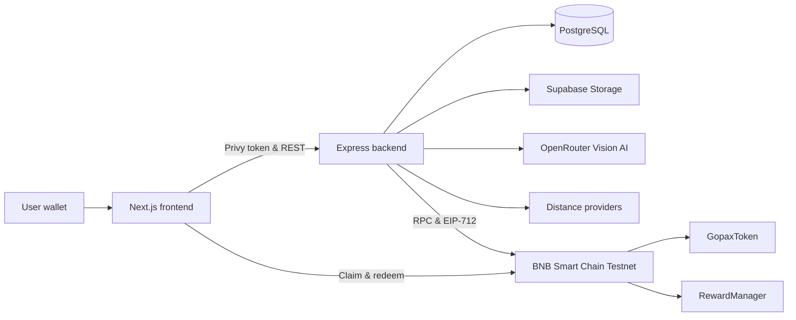

# Gopax

**Turn everyday trips into measurable impact and useful rewards.**

Gopax is a Web3 consumer application for understanding estimated trip emissions. Users upload a travel ticket or receipt, vision AI extracts the trip, deterministic backend rules calculate emissions and rewards, and eligible users claim GOPAX. GOPAX can be redeemed for vouchers on BNB Smart Chain Testnet.

## How it works

1. Sign in with Google to receive a Privy embedded wallet, or connect an external wallet.
2. One Ethereum-compatible address becomes the Gopax account's primary wallet.
3. Upload one JPEG or PNG ticket/receipt, up to 10 MiB.
4. Vision AI extracts trip data; the backend validates it and deterministically calculates distance, emissions, and rewards.
5. The backend creates an EIP-712 claim authorization bound to the wallet, assessment, amount, and deadline.
6. The wallet claims GOPAX. Embedded-wallet transactions request Privy sponsorship; external wallets pay their own BNB gas.
7. Voucher redemption signs an EIP-2612 permit and calls `redeemVoucherWithPermit`, avoiding a separate `approve` transaction.
8. The backend issues a voucher code only after verifying the exact on-chain event.

Key protections include file-signature and size validation, SHA-256 duplicate detection, EIP-712 deadlines, on-chain reward policy, duplicate-claim prevention, transaction-hash replay protection, and interrupted-transaction recovery.

## Architecture

Gopax keeps personal data, proof images, AI processing, and calculations off-chain. Blockchain is used for token ownership, cryptographic authorization, and verifiable transactions.



| Area | Technology |
| --- | --- |
| Frontend | Next.js 16, React 19, TypeScript, Tailwind CSS, TanStack Query |
| Wallet/Web3 | Privy, wagmi, viem, EIP-2612 |
| Backend | Node.js, Express 5, Knex.js |
| Data | PostgreSQL, Supabase Storage |
| AI | OpenRouter-compatible vision models |
| Contracts | Solidity 0.8.24, Foundry, OpenZeppelin |
| Network | BNB Smart Chain Testnet, chain ID `97` |

## Run locally

Prerequisites: Node.js compatible with Next.js 16, npm, PostgreSQL, [Foundry](https://book.getfoundry.sh/getting-started/installation), Supabase with a private bucket, an OpenRouter API key, and tBNB for deployment or external-wallet transactions.

```bash
git clone https://github.com/Mayhikall/gopax.git
cd gopax
cd backend && npm ci && cp .env.example .env && npm run migrate
cd ../frontend && npm ci && cp .env.example .env.local
cd ../contracts && forge install
```

Deploy after completing `contracts/.env`:

```bash
cp .env.example .env
# Edit .env once, then run this single deployment command:
set -a && . ./.env && set +a && forge script script/Deploy.s.sol:DeployScript \
  --rpc-url "$BSC_TESTNET_RPC" \
  --broadcast --verify --verifier etherscan \
  --etherscan-api-key "$ETHERSCAN_API_KEY" -vvvv
```

The deployment grants `MINTER_ROLE` to `RewardManager`. The backend signer must match `authorizedSigner()`, and backend/frontend treasury settings must match `treasury()`.

In Privy Dashboard, enable **Google** and **External wallets**, allow local and deployment origins, then enable sponsorship for **BNB Smart Chain Testnet** and **Allow transactions from the client**.

```bash
cd backend && npm run dev
cd ../frontend && npm run dev
```

Frontend: `http://localhost:3000`. API health: `http://localhost:5000/health`. Fixture preview: `http://localhost:3000/preview`.

## Configuration

Backend-only secrets include `PRIVY_APP_SECRET`, `SUPABASE_SERVICE_ROLE_KEY`, `OPENROUTER_API_KEY`, and `REWARD_SIGNER_PRIVATE_KEY`. Also configure the database, `PRIVY_APP_ID`, storage, AI models, RPC, contract addresses, treasury, CORS, claim TTL, and distance providers.

Every `NEXT_PUBLIC_*` value is browser-visible. The frontend requires the API URL, chain ID, token/manager/treasury addresses, RPC URL, `NEXT_PUBLIC_PRIVY_APP_ID`, and optional preview flag. Never commit `.env` files or private keys.

## Rewards and emissions

| Mode | Emission factor | Reward |
| --- | ---: | ---: |
| Train | 0.01219 kg CO₂e/passenger-km | 95 GOPAX |
| Bus | 0.030 kg CO₂e/passenger-km | 89 GOPAX |
| Motorcycle | 0.082 kg CO₂e/km | 69 GOPAX |
| Car | 0.235 kg CO₂e/km | 10 GOPAX |
| Short/medium/long flight | 0.120 / 0.089 / 0.078 kg CO₂e/passenger-km | 54 / 66 / 70 GOPAX |

```text
estimated emissions = distance × mode factor
car baseline = distance × 0.235
estimated reduction = car baseline - estimated emissions
efficiency score = clamp(1 - emission intensity / 0.235, 0, 1)
reward = 10 + round(90 × efficiency score)
```

Car-baseline reduction applies only to bus and train trips. There is no distance reward multiplier, although flight distance selects the factor band. These figures are estimates, not measurements, carbon credits, or certified environmental reports.

## Smart contracts

`GopaxToken.sol` is an 18-decimal BEP-20 with a 10,000,000 GOPAX cap, role-based minting, and EIP-2612 permit.

`RewardManager.sol` verifies backend EIP-712 authorizations, prevents duplicate claims, enforces reward policy, emits `CarbonRewarded`, transfers redeemed GOPAX to treasury, and emits `VoucherRedeemed`. It supports legacy `redeemVoucher` and atomic `redeemVoucherWithPermit`.

## Live deployment

| Component | Address |
| --- | --- |
| GopaxToken | [`0x518fC1a3EFc6806F0B46C25CbC21a27C216597F5`](https://testnet.bscscan.com/address/0x518fC1a3EFc6806F0B46C25CbC21a27C216597F5) |
| RewardManager | [`0xba6aa6E7685563C56225d085c6cD71a1Ea1a6B4F`](https://testnet.bscscan.com/address/0xba6aa6E7685563C56225d085c6cD71a1Ea1a6B4F) |
| Treasury | [`0xdc22a080D041F4DABdf12fe89Fa45cC898Ab495b`](https://testnet.bscscan.com/address/0xdc22a080D041F4DABdf12fe89Fa45cC898Ab495b) |

The canonical Foundry broadcast artifacts are written under `contracts/broadcast/`. The `contracts/deployments/bsc-testnet.json` file is a manually maintained summary of the active testnet deployment.

## API

Protected endpoints require `Authorization: Bearer <privy-access-token>`.

| Endpoint | Purpose |
| --- | --- |
| `GET /health` | Health check |
| `GET /auth/session` | Resolve Privy session |
| `POST /users`, `GET /users/me` | Write/read profile |
| `POST /trips`, `GET /trips`, `GET /trips/:id` | Upload/list/read trips |
| `POST /trips/:id/assessment/retry` | Retry assessment |
| `POST /trips/:id/claim` | Prepare signed claim |
| `POST /trips/:id/claim/confirm` | Verify receipt and synchronize state |
| `GET /impact` | Read impact aggregate |
| `GET /vouchers`, `GET /vouchers/my-vouchers` | Read catalog/history |
| `POST /vouchers/redeem` | Verify redemption and issue code |

## Testing

```bash
cd contracts && forge test -vvv
cd ../frontend && npm run lint && npm run typecheck && npm run build
```

After a contract interface change, run `npm run abi:sync` in both backend and frontend, update deployment addresses, and repeat end-to-end tests.

## Security and limitations

- Embedded wallets request Privy sponsorship. External EOAs pay BNB gas because this MVP does not use account abstraction for them.
- Relayed receipts may have different `from` and `to`; the backend verifies exact RewardManager events.
- Ticket images and personal data remain off-chain.
- AI never controls emission factors or token amounts and does not replace fraud detection.
- Seeded vouchers are demo data and require merchant agreements before production.
- BSC Testnet tokens have no monetary value.
- The contracts have not been declared production-audited.

## Demo and troubleshooting

Use `/preview` for fixture-based UI without a wallet, backend, AI, or transactions. For an end-to-end demo, configure all integrations and use one consistent deployment.

- **`npm ci` fails:** match `package.json` and `package-lock.json`.
- **Privy login fails:** verify login methods, allowed origins, and matching App IDs.
- **Claim fails:** check chain, RPC, addresses, sponsorship, minter role, signer, deadline, and policy.
- **Redemption fails:** check GOPAX balance, ERC20Permit support, deployment addresses, and event logs.
- **Assessment stalls:** check OpenRouter, Supabase, distance providers, and backend logs.

## Additional documentation

- [Frontend documentation](frontend/README.md)
- [Backend documentation](backend/README.md)
- [Smart-contract documentation](contracts/README.md)
